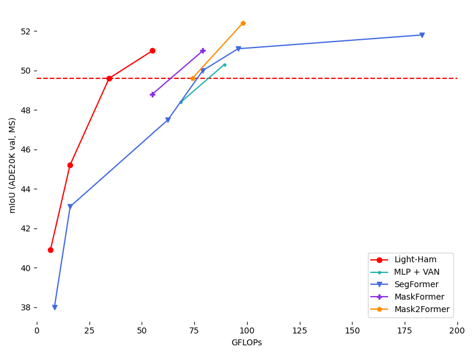

# Enjoy-Hamburger 🍔

Official implementation of Hamburger, *[Is Attention Better Than Matrix Decomposition?](https://openreview.net/forum?id=1FvkSpWosOl)* (ICLR 2021, top 3%)

<div align=center></div>

Squirtle (憨憨) invites you to enjoy Hamburger! 憨 shares the same pronunciation as ham, which means simple and plain in Chinese.

## Update

- 2022.04.01 - Add Light-Ham (VAN-Huge). Given 3 runs, Light-Ham (VAN-Base) produced **an averaged mIoU (MS) of 49.6** on ADE20K `val` set from results of 49.6, 49.9, and 49.2. Note that if we reduce steps K from 6 to 3 under Light-Ham (VAN-Base), the performance will drop to 48.8 (1 run), demonstrating the significance of optimization-driven strategy & MD in Hamburger.
- 2022.03.26 - Release [Light-Ham](https://github.com/Gsunshine/Enjoy-Hamburger/blob/main/seg_light_ham), a light-weight segmentation baseline for modern backbones. Using the [VAN](https://github.com/Visual-Attention-Network) backbone, Light-Ham-VAN sets the best Pareto frontier (Params/FLOPs-mIoU curves) up to date for ADE20K.

  <div align=center></div>

  |   Method  |    Backbone     | Iters | mIoU | Params | FLOPs  | Config | Download  |
  | :-------: | :-------------: | :---: | :--: | :----: | :----: | :----: | :-------: |
  |  Light-Ham-D256  |    VAN-Tiny     | 160K | [40.9](https://github.com/Gsunshine/Enjoy-Hamburger/blob/main/seg_light_ham/work_dirs/hamnet_light_van_tiny_d256_512x512_160k_ade20k/eval_multi_scale_20220321_052101.json) | 4.2M | 6.5G | [config](https://github.com/Gsunshine/Enjoy-Hamburger/blob/main/seg_light_ham/configs/ham/hamnet_light_van_tiny_d256_512x512_160k_ade20k.py)  | [Google Drive](https://drive.google.com/file/d/11XjGgqgqWJOUKdIEWuInQJyi4wAChaWN/view?usp=sharing) |
  |  Light-Ham  |    VAN-Tiny     | 160K | [42.3](https://github.com/Gsunshine/Enjoy-Hamburger/blob/main/seg_light_ham/work_dirs/hamnet_light_van_tiny_512x512_160k_ade20k/eval_multi_scale_20220323_130645.json) | 4.9M | 11.3G |  [config](https://github.com/Gsunshine/Enjoy-Hamburger/blob/main/seg_light_ham/configs/ham/hamnet_light_van_tiny_512x512_160k_ade20k.py)  | [Google Drive](https://drive.google.com/file/d/1MkjNxqOuoVtt58jIKY-11B6TfDrdH1sX/view?usp=sharing) |
  |  Light-Ham-D256  |    VAN-Small    | 160K | [45.2](https://github.com/Gsunshine/Enjoy-Hamburger/blob/main/seg_light_ham/work_dirs/hamnet_light_van_small_d256_512x512_160k_ade20k/eval_multi_scale_20220331_124904.json) | 13.8M | 15.8G | [config](https://github.com/Gsunshine/Enjoy-Hamburger/blob/main/seg_light_ham/configs/ham/hamnet_light_van_small_d256_512x512_160k_ade20k.py)  | [Google Drive](https://drive.google.com/file/d/1ZrGf5hqCM8VJrrp6HgFeuCSTc7jiAcgP/view?usp=sharing) |
  |  Light-Ham  |    VAN-Small    | 160K | [45.7](https://github.com/Gsunshine/Enjoy-Hamburger/blob/main/seg_light_ham/work_dirs/hamnet_light_van_small_512x512_160k_ade20k/eval_multi_scale_20220323_124229.json) | 14.7M | 21.4G | [config](https://github.com/Gsunshine/Enjoy-Hamburger/blob/main/seg_light_ham/configs/ham/hamnet_light_van_small_512x512_160k_ade20k.py)  | [Google Drive](https://drive.google.com/file/d/1ocFNvV2Dr8kXsytY_9QO5FBGk1zTOgS3/view?usp=sharing) |
  |  Light-Ham  |    VAN-Base     | 160K | [49.6](https://github.com/Gsunshine/Enjoy-Hamburger/blob/main/seg_light_ham/work_dirs/hamnet_light_van_base_512x512_160k_ade20k/eval_multi_scale_20220323_135751.json) | 27.4M | 34.4G | [config](https://github.com/Gsunshine/Enjoy-Hamburger/blob/main/seg_light_ham/configs/ham/hamnet_light_van_base_512x512_160k_ade20k.py)  | [Google Drive](https://drive.google.com/file/d/1-wVJgdztqWYv-MvCp6deFO0pDpciAg6h/view?usp=sharing) |
  |  Light-Ham  |    VAN-Large    | 160K | [51.0](https://github.com/Gsunshine/Enjoy-Hamburger/blob/main/seg_light_ham/work_dirs/hamnet_light_van_large_512x512_160k_ade20k/eval_multi_scale_20220323_142104.json) | 45.6M | 55.0G | [config](https://github.com/Gsunshine/Enjoy-Hamburger/blob/main/seg_light_ham/configs/ham/hamnet_light_van_large_512x512_160k_ade20k.py)  | [Google Drive](https://drive.google.com/file/d/1iW-upuWcZybJyGv8_3qnpgGoX0Wq9emk/view?usp=sharing) |
  |  Light-Ham  |    VAN-Huge    | 160K | [51.5](https://github.com/Gsunshine/Enjoy-Hamburger/blob/main/seg_light_ham/work_dirs/hamnet_light_van_huge_512x512_160k_ade20k/eval_multi_scale_20220328_110130.json) | 61.1M | 71.8G | [config](https://github.com/Gsunshine/Enjoy-Hamburger/blob/main/seg_light_ham/configs/ham/hamnet_light_van_large_512x512_160k_ade20k.py)  | [Google Drive](https://drive.google.com/file/d/1ri-rnapaBRK2oW3CuYNZaTdGGUeZC9x7/view?usp=sharing) |
  |  -  | - | - | - | -  | - | - | - |
  |  Segformer  |    VAN-Base    | 160K | 48.4 | 29.3M | 68.6G | - | - |
  |  Segformer  |    VAN-Large   | 160K | 50.3 | 47.5M | 89.2G | - | - |
  |  -  | - | - | - | -  | - | - | - |
  |  HamNet  |    VAN-Tiny-OS8     | 160K | 41.5 | 11.9M | 50.8G | [config](https://github.com/Gsunshine/Enjoy-Hamburger/blob/main/seg_light_ham/configs/upernet/VAN/upernet_van_tiny_512x512_160k_ade20k.py)  | [Google Drive](https://drive.google.com/file/d/1T1BxnBr4rErKaKiUwp_xF-Ik7j7jINJR/view?usp=sharing) |
  |  HamNet  |    VAN-Small-OS8    | 160K | 45.1 | 24.2M | 100.6G |   [config](https://github.com/Gsunshine/Enjoy-Hamburger/blob/main/seg_light_ham/configs/upernet/VAN/upernet_van_small_512x512_160k_ade20k.py)  | [Google Drive](https://drive.google.com/file/d/1kfZIMZINOprSL6G113sm_KjPlE10nbWz/view?usp=sharing) |
  |  HamNet  |    VAN-Base-OS8     | 160K | 48.7 | 36.9M | 153.6G | [config](https://github.com/Gsunshine/Enjoy-Hamburger/blob/main/seg_light_ham/configs/upernet/VAN/upernet_van_base_512x512_160k_ade20k.py)  | [Google Drive](https://drive.google.com/file/d/1jH1jx6KPckEL0-Ozje0koT8uFw0Bjyfi/view?usp=sharing) |
  |  HamNet  |    VAN-Large-OS8    | 160K | 50.2 | 55.1M | 227.7G | [config](https://github.com/Gsunshine/Enjoy-Hamburger/blob/main/seg_light_ham/configs/upernet/VAN/upernet_van_large_512x512_160k_ade20k.py)  | [Google Drive](https://drive.google.com/file/d/1tPEQ9W1Pn_Bmkn3eGOtjM8dMZ0mTK4ka/view?usp=sharing) |

- 2022.03.06 - Update HamNet using [MMSegmentation](https://github.com/open-mmlab/mmsegmentation). HamNet achieves SOTA performance for ResNet-101 backbone on ADE20K `val` set, enabling R101 to match modern backbones like [ResNeSt](https://github.com/zhanghang1989/ResNeSt), [Swin Transformer](https://github.com/microsoft/Swin-Transformer) or [ConvNeXt](https://github.com/facebookresearch/ConvNeXt) using similar computing budget. Code and [checkpoint](https://drive.google.com/file/d/1ja_SwzMg0a2NFW1d5gqg91QKgJrjuGYy/view?usp=sharing) are available.
  
  | Method | Backbone | Crop Size | Lr schd | mIoU (SS) | mIoU (MS) | Params | FLOPs |
  |:---:|:---:|:---:|:---:|:---:|:---:|:---:|:---:|
  | DANet     | ResNet-101  | 512x512 | 160000 |  -   | 45.2 | 69M | 1119G |
  | OCRNet    | ResNet-101  | 520x520 | 150000 |  -   | 45.3 | **56M** | 923G  |
  | DNL       | ResNet-101  | 512x512 | 160000 |  -   | 46.0 | 69M | 1249G |
  | HamNet    | ResNet-101  | 512x512 | 160000 | 44.9 | **46.0** | **57M** | **918G**  |
  | HamNet+   | ResNet-101  | 512x512 | 160000 | [45.6](https://github.com/Gsunshine/Enjoy-Hamburger/blob/main/seg_mm/work_dirs/ham_r101-d8_512x512_160k_ade20k/eval_single_scale_20220304_121400.json) | [**46.8**](https://github.com/Gsunshine/Enjoy-Hamburger/blob/main/seg_mm/work_dirs/ham_r101-d8_512x512_160k_ade20k/eval_multi_scale_20220304_115440.json) | 69M | 1111G |
  | - | - |  - |  - | - | - | - | - |
  | DeeplabV3 | ResNeSt-101 | 512x512 | 160000 | 45.7 | 46.6 | 66M | 1051G |
  | UPerNet   | Swin-T      | 512x512 | 160000 | 44.5 | 45.8 | 60M | 945G  |
  | UPerNet   | ConvNeXt-T  | 512x512 | 160000 | 46.0 | 46.7 | 60M | 939G  |

- 2021.09.09 - Release the [arXiv](https://arxiv.org/abs/2109.04553) version. This is a short version including some *future works* based Hamburger. A long version concerning the implicit perspective of Hamburger will be updated later.
- 2021.05.12 - Release Chinese [Blog 3](https://zhuanlan.zhihu.com/p/370410446).
- 2021.05.10 - Release Chinese [Blog 1](https://zhuanlan.zhihu.com/p/369769485) and [Blog 2](https://zhuanlan.zhihu.com/p/369855045) on Zhihu. Blog 3 is incoming.
- 2021.04.14 - Herald the incoming arXiv version concerning implicit models and one-step gradient.
- 2021.04.13 - Add poster and thumbnail icon for ICLR 2021.

## Introduction

This repo provides the official implementation of Hamburger for further research. We sincerely hope that this paper can bring you inspiration about the Attention Mechanism, especially how **the low-rankness and the optimization-driven method** can help model the so-called *Global Information* in deep learning. We also highlight **Hamburger as a semi-implicit model and one-step gradient as an alternative for training both implicit and semi-implicit models**.

We model the global context issue as a low-rank completion problem and show that its optimization algorithms can help design global information blocks. This paper then proposes a series of Hamburgers, in which we employ the optimization algorithms for solving MDs to factorize the input representations into sub-matrices and reconstruct a low-rank embedding. Hamburgers with different MDs can perform favorably against the popular global context module self-attention when carefully coping with gradients back-propagated through MDs.


We are working on some exciting topics. Please wait for our new papers. :)

Enjoy Hamburger, please!

## Organization

This section introduces the organization of this repo.

**We strongly recommend our readers to enjoy the [arXiv](https://arxiv.org/abs/2109.04553) version or the blogs to more comprehensively understand this paper.**

- blog.
  - Some random thoughts on Hamburger and beyond (Chinese [Blog 1](https://zhuanlan.zhihu.com/p/369769485)).
  - Connections and differences between Hamburger and implicit models. (incoming arXiv version, Chinese [Blog 2](https://zhuanlan.zhihu.com/p/369855045))
  - Highlight one-step gradient. (incoming arXiv version, Chinese [Blog 2](https://zhuanlan.zhihu.com/p/369855045))
  - Possible directions based on Hamburger. (current [arXiv](https://arxiv.org/abs/2109.04553) version, Chinese [Blog 3](https://zhuanlan.zhihu.com/p/370410446))
  - FAQ.
- seg.
  - We provide the PyTorch implementation of Hamburger (V1) in the paper and an enhanced version (V2) flavored with Cheese. Some experimental features are included in V2+.
  - We release the codebase for systematical research on the PASCAL VOC dataset, including the two-stage training on the `trainaug` and `trainval` datasets and the MSFlip test.
  - We offer three checkpoints of HamNet, in which one is 85.90+ with the test server [link](http://host.robots.ox.ac.uk:8080/anonymous/NEHYHH.html), while the other two are 85.80+ with the test server [link 1](http://host.robots.ox.ac.uk:8080/anonymous/HEBCIV.html) and [link 2](http://host.robots.ox.ac.uk:8080/anonymous/3VNCPH.html). You can reproduce the test results using the checkpoints combined with the MSFlip test code.
  - Statistics about HamNet that might ease further research.
- gan.
  - Official implementation of Hamburger in TensorFlow.
  - Data preprocessing code for using ImageNet in tensorflow-datasets. (Possibly useful if you hope to run the JAX code of [BYOL](https://github.com/deepmind/deepmind-research/tree/master/byol) or other ImageNet training code with the Cloud TPUs.)
  - Training and evaluation protocol of HamGAN on the ImageNet.
  - Checkpoints of HamGAN-strong and HamGAN-baby.

TODO:

- [x] Chinese [Blog 1](https://zhuanlan.zhihu.com/p/369769485), [Blog 2](https://zhuanlan.zhihu.com/p/369855045) and [Blog 3](https://zhuanlan.zhihu.com/p/370410446).
- [x] Release the arXiv version.
- [ ] English Blog.
- [ ] README doc for HamGAN.
- [ ] PyTorch Hamburger using less encapsulation.
- [x] Suggestions for using and further developing Hamburger. (See [arXiv](https://arxiv.org/abs/2109.04553))
- [ ] ~~We also consider adding a collection of popular context modules to this repo.~~ It depends on the time. No Guarantee. Perhaps GuGu 🕊️ (which means standing someone up).

## Citation

If you find our work interesting or helpful to your research, please consider citing Hamburger. :)

```bib
@inproceedings{
    ham,
    title={Is Attention Better Than Matrix Decomposition?},
    author={Zhengyang Geng and Meng-Hao Guo and Hongxu Chen and Xia Li and Ke Wei and Zhouchen Lin},
    booktitle={International Conference on Learning Representations},
    year={2021},
}
```

## Contact

Feel free to contact me if you have additional questions or have interests in collaboration. Please drop me an email at zhengyanggeng@gmail.com. Find me at [Twitter](https://twitter.com/ZhengyangGeng) or [WeChat](assets/WeChat.jpg). Thank you!

## Acknowledgments

Our research is supported with Cloud TPUs from Google's [Tensorflow Research Cloud (TFRC)](https://www.tensorflow.org/tfrc). Nice and joyful experience with the TFRC program. Thank you!

We would like to sincerely thank [MMSegmentation](https://github.com/open-mmlab/mmsegmentation), [EMANet](https://github.com/XiaLiPKU/EMANet), [PyTorch-Encoding](https://github.com/zhanghang1989/PyTorch-Encoding), [YLG](https://github.com/giannisdaras/ylg/tree/train), and [TF-GAN](https://github.com/tensorflow/gan) for their awesome released code.
