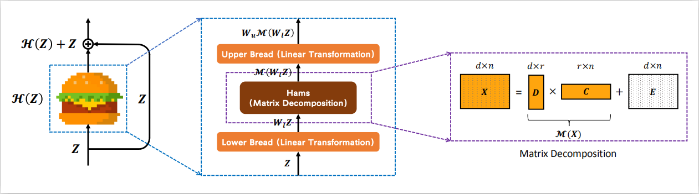

# Enjoy-Hamburger 🍔

Official implementation of Hamburger, *[Is Attention Better Than Matrix Decomposition?](https://openreview.net/forum?id=1FvkSpWosOl)* (ICLR 2021, top 3%)

<div align=center></div>

Squirtle (憨憨) invites you to enjoy Hamburger! 憨 shares the same pronunciation as ham, which means simple and plain in Chinese.

Under construction.

## Update

- 2021.10.09 - ...
- 2021.09.09 - Release the [arXiv](https://arxiv.org/abs/2109.04553) version. This is a short version including some *future works* based Hamburger. A long version concerning the implicit perspective of Hamburger will be updated later.
- 2021.05.12 - Release Chinese [Blog 3](https://zhuanlan.zhihu.com/p/370410446).
- 2021.05.10 - Release Chinese [Blog 1](https://zhuanlan.zhihu.com/p/369769485) and [Blog 2](https://zhuanlan.zhihu.com/p/369855045) on Zhihu. Blog 3 is incoming.
- 2021.04.14 - Herald the incoming arXiv version concerning implicit models and one-step gradient.
- 2021.04.13 - Add poster and thumbnail icon for ICLR 2021.

## Introduction

This repo provides the official implementation of Hamburger for further research. We sincerely hope that this paper can bring you inspiration about the Attention Mechanism, especially how **the low-rankness and the optimization-driven method** can help model the so-called *Global Information* in deep learning. We also highlight **Hamburger as a semi-implicit model and one-step gradient as an alternative for training both implicit and semi-implicit models**.

We model the global context issue as a low-rank completion problem and show that its optimization algorithms can help design global information blocks. This paper then proposes a series of Hamburgers, in which we employ the optimization algorithms for solving MDs to factorize the input representations into sub-matrices and reconstruct a low-rank embedding. Hamburgers with different MDs can perform favorably against the popular global context module self-attention when carefully coping with gradients back-propagated through MDs.



We are working on some exciting topics. Please wait for our new papers. :)

Enjoy Hamburger, please!

## Organization

This section introduces the organization of this repo.

**We strongly recommend our readers to enjoy the [arXiv](https://arxiv.org/abs/2109.04553) version or the blogs to more comprehensively understand this paper.**

- blog.
  - Some random thoughts on Hamburger and beyond (Chinese [Blog 1](https://zhuanlan.zhihu.com/p/369769485)).
  - Connections and differences between Hamburger and implicit models. (incoming arXiv version, Chinese [Blog 2](https://zhuanlan.zhihu.com/p/369855045))
  - Highlight one-step gradient. (incoming arXiv version, Chinese [Blog 2](https://zhuanlan.zhihu.com/p/369855045))
  - Possible directions based on Hamburger. (current [arXiv](https://arxiv.org/abs/2109.04553) version, Chinese [Blog 3](https://zhuanlan.zhihu.com/p/370410446))
  - FAQ.
- seg.
  - We provide the PyTorch implementation of Hamburger (V1) in the paper and an enhanced version (V2) flavored with Cheese. Some experimental features are included in V2+.
  - We release the codebase for systematical research on the PASCAL VOC dataset, including the two-stage training on the `trainaug` and `trainval` datasets and the MSFlip test.
  - We offer three checkpoints of HamNet, in which one is 85.90+ with the test server [link](http://host.robots.ox.ac.uk:8080/anonymous/NEHYHH.html), while the other two are 85.80+ with the test server [link 1](http://host.robots.ox.ac.uk:8080/anonymous/HEBCIV.html) and [link 2](http://host.robots.ox.ac.uk:8080/anonymous/3VNCPH.html). You can reproduce the test results using the checkpoints combined with the MSFlip test code.
  - Statistics about HamNet that might ease further research.
- gan.
  - Official implementation of Hamburger in TensorFlow.
  - Data preprocessing code for using ImageNet in tensorflow-datasets. (Possibly useful if you hope to run the JAX code of [BYOL](https://github.com/deepmind/deepmind-research/tree/master/byol) or other ImageNet training code with the Cloud TPUs.)
  - Training and evaluation protocol of HamGAN on the ImageNet.
  - Checkpoints of HamGAN-strong and HamGAN-baby.

TODO:

- [x] Chinese [Blog 1](https://zhuanlan.zhihu.com/p/369769485), [Blog 2](https://zhuanlan.zhihu.com/p/369855045) and [Blog 3](https://zhuanlan.zhihu.com/p/370410446).
- [x] Release the arXiv version.
- [ ] English Blog.
- [ ] README doc for HamGAN.
- [ ] PyTorch Hamburger using less encapsulation.
- [x] Suggestions for using and further developing Hamburger. (See [arXiv](https://arxiv.org/abs/2109.04553))
- [ ] ~~We also consider adding a collection of popular context modules to this repo.~~ It depends on the time. No Guarantee. Perhaps GuGu 🕊️ (which means standing someone up).

## Citation

If you find our work interesting or helpful to your research, please consider citing Hamburger. :)

```bib
@inproceedings{
    ham,
    title={Is Attention Better Than Matrix Decomposition?},
    author={Zhengyang Geng and Meng-Hao Guo and Hongxu Chen and Xia Li and Ke Wei and Zhouchen Lin},
    booktitle={International Conference on Learning Representations},
    year={2021},
}
```

## Contact

Feel free to contact me if you have additional questions or have interests in collaboration. Please drop me an email at zhengyanggeng@gmail.com. Find me at [Twitter](https://twitter.com/ZhengyangGeng) or [WeChat](assets/WeChat.jpg). Thank you!

## Acknowledgments

Our research is supported with Cloud TPUs from Google's [Tensorflow Research Cloud (TFRC)](https://www.tensorflow.org/tfrc). Nice and joyful experience with the TFRC program. Thank you!

We would like to sincerely thank [EMANet](https://github.com/XiaLiPKU/EMANet), [PyTorch-Encoding](https://github.com/zhanghang1989/PyTorch-Encoding), [YLG](https://github.com/giannisdaras/ylg/tree/train), and [TF-GAN](https://github.com/tensorflow/gan) for their awesome released code.
