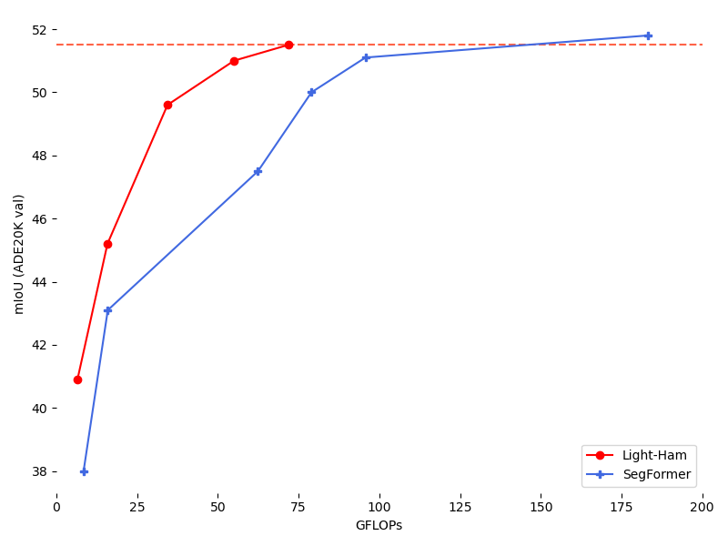

# Light-Ham

This is a PyTorch implementation of Light-Ham combined with the [VAN](https://github.com/Visual-Attention-Network) backbone.
The code is based on [MMSegmentation](https://github.com/open-mmlab/mmsegmentation).
More details can be found in [Visual Attention Network](https://arxiv.org/abs/2202.09741).

## Citation

```bib
@inproceedings{
    ham,
    title={Is Attention Better Than Matrix Decomposition?},
    author={Zhengyang Geng and Meng-Hao Guo and Hongxu Chen and Xia Li and Ke Wei and Zhouchen Lin},
    booktitle={International Conference on Learning Representations},
    year={2021},
}

@article{guo2022visual,
  title={Visual Attention Network},
  author={Guo, Meng-Hao and Lu, Cheng-Ze and Liu, Zheng-Ning and Cheng, Ming-Ming and Hu, Shi-Min},
  journal={arXiv preprint arXiv:2202.09741},
  year={2022}
}
```

## Results

**Notes**: Pre-trained models can be found in [Visual Attention Network for Classification](https://github.com/Visual-Attention-Network/VAN-Classification).

### VAN + Light-Ham / HamNet

<div align=center></div>

  |   Method  |    Backbone     | Iters | mIoU | Params | FLOPs  | Config | Download  |
  | :-------: | :-------------: | :---: | :--: | :----: | :----: | :----: | :-------: |
  |  Light-Ham-D256  |    VAN-Tiny     | 160K | [40.9](https://github.com/Gsunshine/Enjoy-Hamburger/blob/main/seg_light_ham/work_dirs/hamnet_light_van_tiny_d256_512x512_160k_ade20k/eval_multi_scale_20220321_052101.json) | 4.2M | 6.5G | [config](https://github.com/Gsunshine/Enjoy-Hamburger/blob/main/seg_light_ham/configs/ham/hamnet_light_van_tiny_d256_512x512_160k_ade20k.py)  | [Google Drive](https://drive.google.com/file/d/11XjGgqgqWJOUKdIEWuInQJyi4wAChaWN/view?usp=sharing) |
  |  Light-Ham  |    VAN-Tiny     | 160K | [42.3](https://github.com/Gsunshine/Enjoy-Hamburger/blob/main/seg_light_ham/work_dirs/hamnet_light_van_tiny_512x512_160k_ade20k/eval_multi_scale_20220323_130645.json) | 4.9M | 11.3G |  [config](https://github.com/Gsunshine/Enjoy-Hamburger/blob/main/seg_light_ham/configs/ham/hamnet_light_van_tiny_512x512_160k_ade20k.py)  | [Google Drive](https://drive.google.com/file/d/1MkjNxqOuoVtt58jIKY-11B6TfDrdH1sX/view?usp=sharing) |
  |  Light-Ham-D256  |    VAN-Small    | 160K | [45.2](https://github.com/Gsunshine/Enjoy-Hamburger/blob/main/seg_light_ham/work_dirs/hamnet_light_van_small_d256_512x512_160k_ade20k/eval_multi_scale_20220331_124904.json) | 13.8M | 15.8G | [config](https://github.com/Gsunshine/Enjoy-Hamburger/blob/main/seg_light_ham/configs/ham/hamnet_light_van_small_d256_512x512_160k_ade20k.py)  | [Google Drive](https://drive.google.com/file/d/1ZrGf5hqCM8VJrrp6HgFeuCSTc7jiAcgP/view?usp=sharing) |
  |  Light-Ham  |    VAN-Small    | 160K | [45.7](https://github.com/Gsunshine/Enjoy-Hamburger/blob/main/seg_light_ham/work_dirs/hamnet_light_van_small_512x512_160k_ade20k/eval_multi_scale_20220323_124229.json) | 14.7M | 21.4G | [config](https://github.com/Gsunshine/Enjoy-Hamburger/blob/main/seg_light_ham/configs/ham/hamnet_light_van_small_512x512_160k_ade20k.py)  | [Google Drive](https://drive.google.com/file/d/1ocFNvV2Dr8kXsytY_9QO5FBGk1zTOgS3/view?usp=sharing) |
  |  Light-Ham  |    VAN-Base     | 160K | [49.6](https://github.com/Gsunshine/Enjoy-Hamburger/blob/main/seg_light_ham/work_dirs/hamnet_light_van_base_512x512_160k_ade20k/eval_multi_scale_20220323_135751.json) | 27.4M | 34.4G | [config](https://github.com/Gsunshine/Enjoy-Hamburger/blob/main/seg_light_ham/configs/ham/hamnet_light_van_base_512x512_160k_ade20k.py)  | [Google Drive](https://drive.google.com/file/d/1-wVJgdztqWYv-MvCp6deFO0pDpciAg6h/view?usp=sharing) |
  |  Light-Ham  |    VAN-Large    | 160K | [51.0](https://github.com/Gsunshine/Enjoy-Hamburger/blob/main/seg_light_ham/work_dirs/hamnet_light_van_large_512x512_160k_ade20k/eval_multi_scale_20220323_142104.json) | 45.6M | 55.0G | [config](https://github.com/Gsunshine/Enjoy-Hamburger/blob/main/seg_light_ham/configs/ham/hamnet_light_van_large_512x512_160k_ade20k.py)  | [Google Drive](https://drive.google.com/file/d/1iW-upuWcZybJyGv8_3qnpgGoX0Wq9emk/view?usp=sharing) |
  |  Light-Ham  |    VAN-Huge    | 160K | [51.5](https://github.com/Gsunshine/Enjoy-Hamburger/blob/main/seg_light_ham/work_dirs/hamnet_light_van_huge_512x512_160k_ade20k/eval_multi_scale_20220328_110130.json) | 61.1M | 71.8G | [config](https://github.com/Gsunshine/Enjoy-Hamburger/blob/main/seg_light_ham/configs/ham/hamnet_light_van_large_512x512_160k_ade20k.py)  | [Google Drive](https://drive.google.com/file/d/1ri-rnapaBRK2oW3CuYNZaTdGGUeZC9x7/view?usp=sharing) |
  |  -  | - | - | - | -  | - | - | - |
  |  Segformer  |    VAN-Base    | 160K | 48.4 | 29.3M | 68.6G | - | - |
  |  Segformer  |    VAN-Large   | 160K | 50.3 | 47.5M | 89.2G | - | - |
  |  -  | - | - | - | -  | - | - | - |
  |  HamNet  |    VAN-Tiny-OS8     | 160K | 41.5 | 11.9M | 50.8G | [config](https://github.com/Gsunshine/Enjoy-Hamburger/blob/main/seg_light_ham/configs/upernet/VAN/upernet_van_tiny_512x512_160k_ade20k.py)  | [Google Drive](https://drive.google.com/file/d/1T1BxnBr4rErKaKiUwp_xF-Ik7j7jINJR/view?usp=sharing) |
  |  HamNet  |    VAN-Small-OS8    | 160K | 45.1 | 24.2M | 100.6G |   [config](https://github.com/Gsunshine/Enjoy-Hamburger/blob/main/seg_light_ham/configs/upernet/VAN/upernet_van_small_512x512_160k_ade20k.py)  | [Google Drive](https://drive.google.com/file/d/1kfZIMZINOprSL6G113sm_KjPlE10nbWz/view?usp=sharing) |
  |  HamNet  |    VAN-Base-OS8     | 160K | 48.7 | 36.9M | 153.6G | [config](https://github.com/Gsunshine/Enjoy-Hamburger/blob/main/seg_light_ham/configs/upernet/VAN/upernet_van_base_512x512_160k_ade20k.py)  | [Google Drive](https://drive.google.com/file/d/1jH1jx6KPckEL0-Ozje0koT8uFw0Bjyfi/view?usp=sharing) |
  |  HamNet  |    VAN-Large-OS8    | 160K | 50.2 | 55.1M | 227.7G | [config](https://github.com/Gsunshine/Enjoy-Hamburger/blob/main/seg_light_ham/configs/upernet/VAN/upernet_van_large_512x512_160k_ade20k.py)  | [Google Drive](https://drive.google.com/file/d/1tPEQ9W1Pn_Bmkn3eGOtjM8dMZ0mTK4ka/view?usp=sharing) |

**Notes**: In this scheme, we use multi-scale validation following Swin-Transformer. FLOPs are tested under the input size of 512 x 512 using [torchprofile](https://github.com/zhijian-liu/torchprofile) (recommended, highly accurate and automatic MACs/FLOPs statistics).

## Preparation

Install MMSegmentation and download ADE20K according to the guidelines in MMSegmentation.

## Training

We use 8 GPUs for training by default. Run:

```bash
bash dist_train.sh /path/to/config 8
```

## Evaluation

To evaluate the model, run:

```bash
bash dist_test.sh /path/to/config /path/to/checkpoint_file 8 --out results.pkl --eval mIoU --aug-test
```

## FLOPs

Install torchprofile using

```bash
pip install torchprofile
```

To calculate FLOPs for a model, run:

```bash
bash tools/flops.sh /path/to/checkpoint_file --shape 512 512
```
